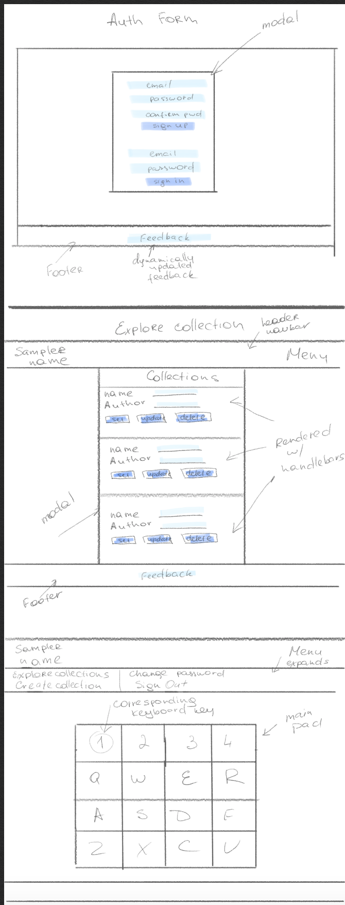
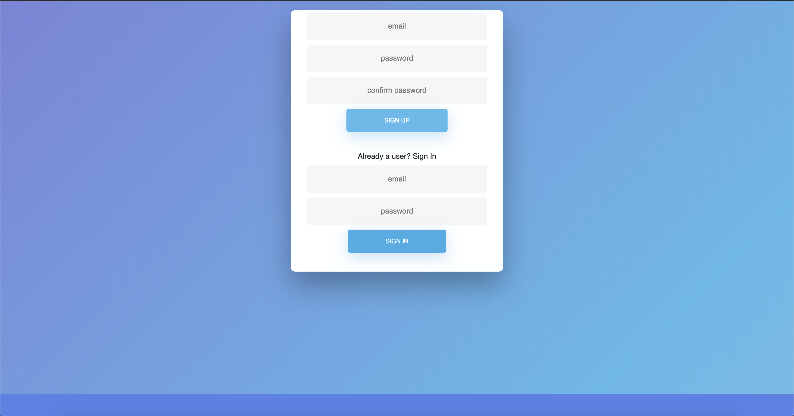
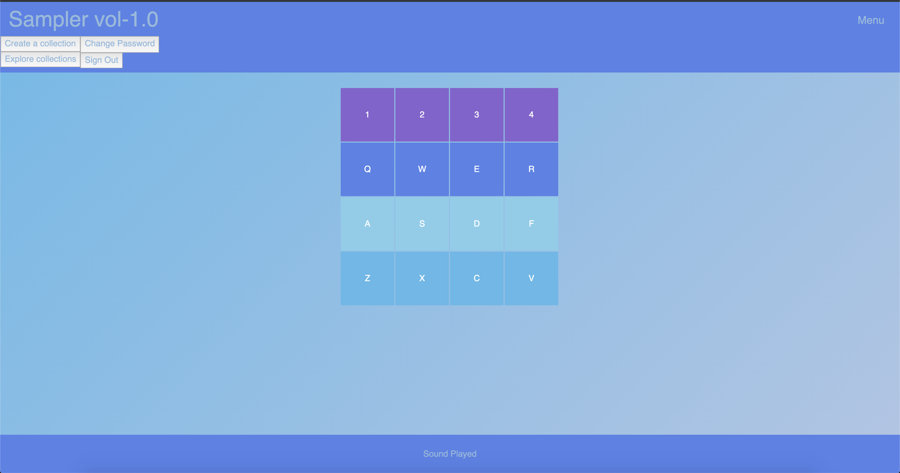
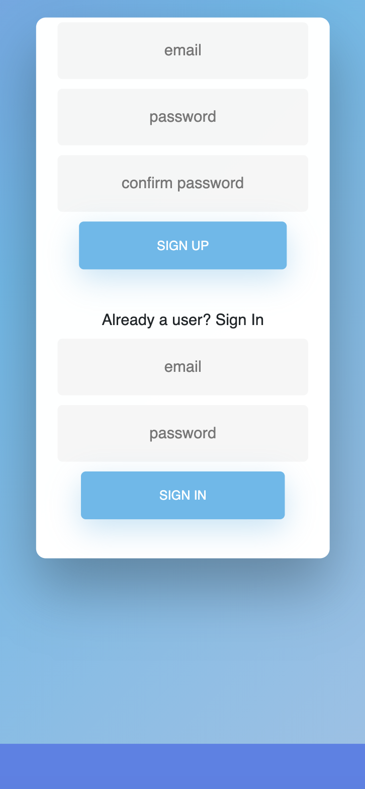
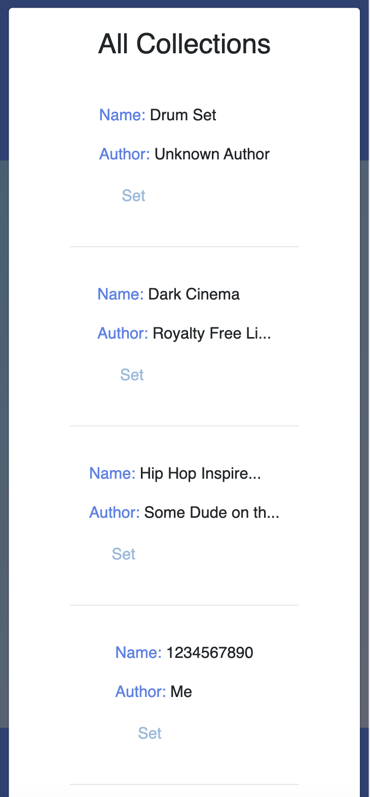
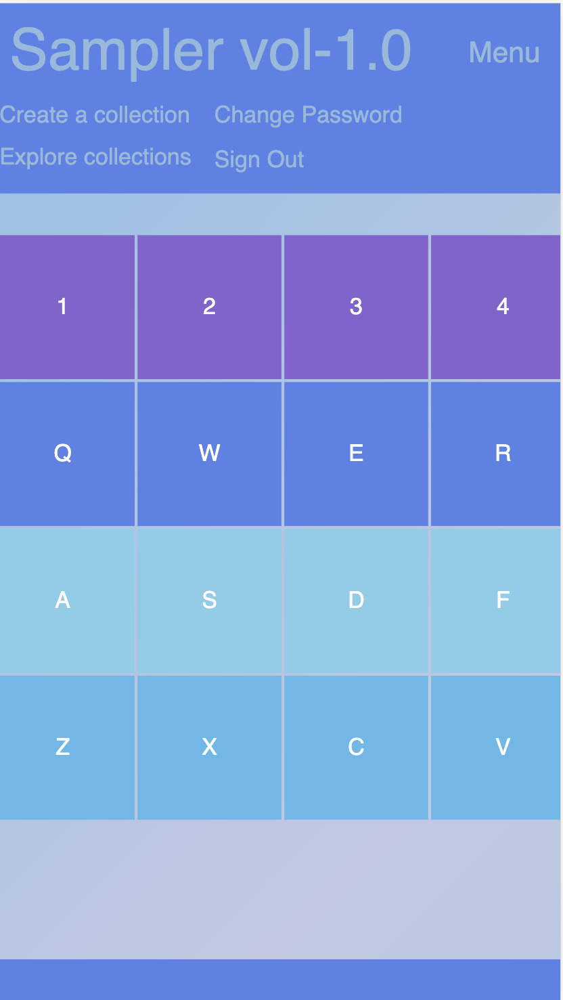
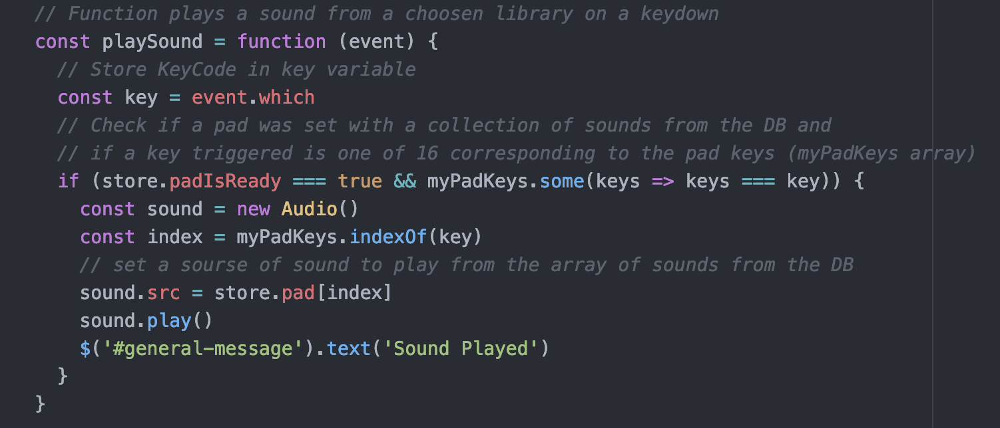
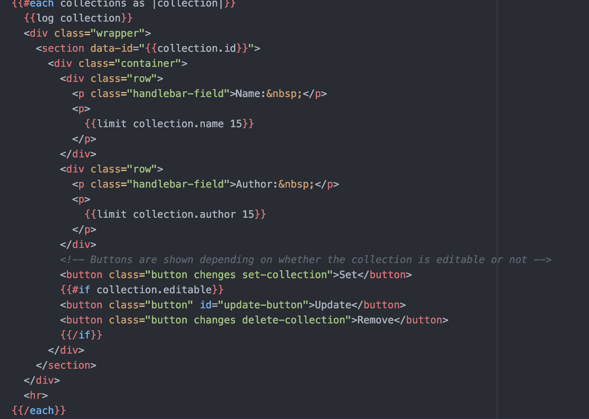

# Audio Sampler Project Vol. 1.0

# Project Description
This project is an in-browser DJ Audio Sampler. A sampler is an electronic or digital musical instrument which uses sound recordings (or "samples") of real instrument sounds(Wikipedia).

The app allows a user to pick a collection of pre-built audio samples or create their own collection and play music in the same way DJs do!

The Front End app is developed with the use of such moder technologies as HTML5/CSS3/JS ES6, AJAX, jQurey, and SASS and Bootstrap

The Back End of the project in built with Ruby and Ruby on Rails.

## Table of contents
* [Development process](#development-process)
* [Links](#links)
* [Screenshots](#screenshots)
* [Technologies](#technologies)
* [Code Examples](#code-examples)
* [Features](#features)
* [Status](#status)
* [License](#license)
* [Contact](#contact)

## Development process

Here are the user stories and the wireframes that I created during the process:

As a user, I want to:

* Be able to sign up and sign in
* Be able to add a pre-built collection of samples from the library to my favorites
* Once added to my favorites, I want to be able to customize the collection
* Be able to pick one pre-built collection of samples to play it
* When hit a key on the keyboard, I want to hear a sample associated with that key

## Links
Deployed App (Front End): https://elinagorshkova.github.io/sampler-vol-1.0/
GitHub Repo (Front End): https://github.com/elinagorshkova/sampler-vol-1.0
Deployed Back End: https://agile-ocean-62490.herokuapp.com/
GitHub Repo (Back End): https://github.com/elinagorshkova/sampler-api-client

## Screenshots

## Technologies
Project created with:
* Ruby on Rails
* HTML5
* CSS3
* JavaScript ES6
* Bootstrap 4
* SASS 1.22.10
* Ajax
* jQuery 3.4.1
* Hadlebars

## Code Examples

## Features
List of features ready and TODOs for future development
* SPA: the app does not require refreshing the page in any case, that significantly improves user`s experiemce.
* Store data: the app keeps the user`s data and allows access to the user's collections of sounds

To-do list:
* Add Drag and Drop feature, so the user can create their own library of sounds fast and easily.
* Add favorites: save number of libraries for a faster assec
* Add search by name feature

## Status
Project is in progress.
Continue adding new features.

## License

This project is licensed under the terms of the MIT license. See the LICENSE file for details.

## Contact
Created by Elina Gorshkova(https://github.com/elinagorshkova, https://www.linkedin.com/in/egorshkova/) - feel free to contact me!
