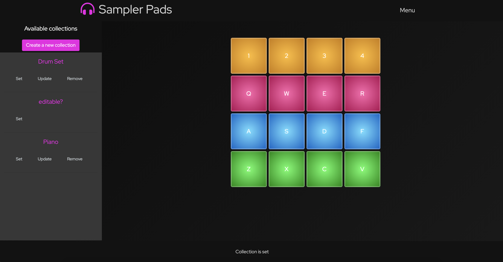

# Audio Sampler Project Vol. 1.0

# Project Description
This project is an in-browser DJ Audio Sampler. A sampler is an electronic or digital musical instrument which uses sound recordings (or "samples") of real instrument sounds(Wikipedia).

The app allows a user to pick a collection of pre-built audio samples or create their own collection and play music in the same way DJs do!

The Front End app is developed with the use of such moder technologies as HTML5/CSS3/ES6, AJAX, jQurey, and SASS and Bootstrap.
The functionality relies on AWS S3 file upload integration.

The Back End of the project is built with Node.js and Express.js.

## Table of contents
* [Development process](#development-process)
* [Links](#links)
* [Screenshots](#screenshots)
* [Technologies](#technologies)
* [Code Examples](#code-examples)
* [Nice-to-have list](#nice-to-have-list)
* [Status](#status)
* [License](#license)
* [Contact](#contact)

## Development process

Here are the user stories and the wireframes that I created during the process:

As a user, I want to:

* Be able to sign up and sign in
* Be able to change password
* Be able to sign out

* See all the available collections of sounds
* Be able to pick a collection of samples to play with it
* When hit a key on the keyboard, I want to hear a sample associated with that key
* Be able to create my own collection of sounds with audio files uploaded
* Be able to update and delete the collections that I`ve created

## Links
Deployed App (Front End): http://elinag.dev/sampler-vol-1.0/

GitHub Repo (Front End): https://github.com/elinagorshkova/sampler-vol-1.0

Deployed Back End: https://agile-ocean-62490.herokuapp.com/

GitHub Repo (Back End): https://github.com/elinagorshkova/sampler-api-client

## Screenshots

## Technologies
Project created with:
* HTML5
* CSS3
* JavaScript ES6
* Bootstrap 4
* SASS 1.22.10
* Ajax
* jQuery 3.4.1
* Hadlebars

* Node.js
* Express.js
* AWS S3

## Code Examples

## Nice-to-have list:
* Add Drag and Drop feature, so the user can create their own library of sounds fast and easily.
* Add favorites: save number of libraries for a faster access
* Add search collection by name feature

## Status
Project is in progress.
Continue adding new features.

## License

This project is licensed under the terms of the MIT license. See the LICENSE file for details.

## Contact
Created by Elina Gorshkova(https://github.com/elinagorshkova, https://www.linkedin.com/in/egorshkova/) - feel free to contact me!
